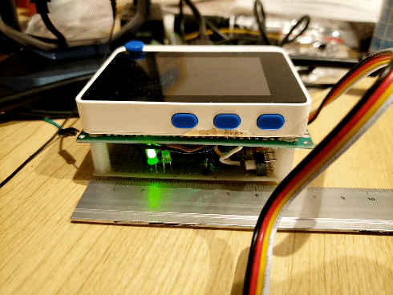

# Examples
## Sample 1
- Basic Usage
    - Set CAN Baudrage
    - Receive CAN Data
## Sample 2
- Blink LED
    - controll digital output pin (RXnBF).
    - 

## Sample 3
- Send back data
    - Reecive CAN Data
    - Send back received CAN Data